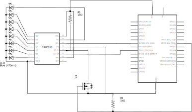
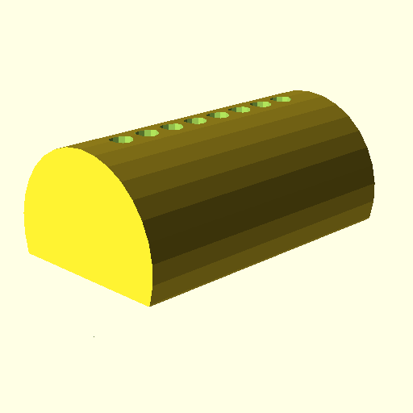
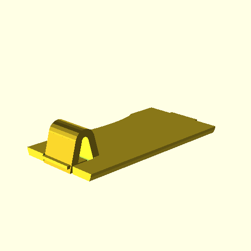

# PiPuGym

Project to create a module for Raspberry Pi that can display the
number of active people in PureGym as a simple bar chart made from
LEDs. The project consists of the following components:

* Python3 code for accessing the PureGym website and reading the
  number of active people in gym.
* Schematic for a SPI LED display.
* OpenSCAD model for 3D printing of a housing.

# Circuit schematic

# Housing

The housing consists of two parts: case and back. See renders below:

